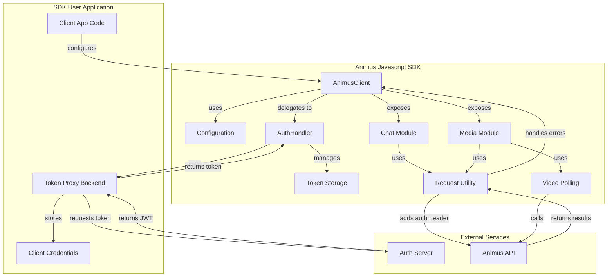

# Animus Javascript SDK (Browser) - MVP Plan

## 1. Overview & Goals

This document outlines the plan for the Minimum Viable Product (MVP) of the Animus Javascript SDK, designed specifically for browser environments.

The primary goal is to provide Animus clients with an extremely simple and easy-to-use interface for integrating with the Animus AI API from their frontend applications, abstracting away the complexities of authentication and API interactions.

## 2. Core Principles

*   **Simplicity:** Prioritize ease of integration and use for the client developer.
*   **Abstraction:** Hide complexities of authentication (token fetching/storage) and asynchronous operations (video polling).
*   **Browser-First:** Design specifically for browser environments using standard web APIs (`fetch`, `localStorage`/`sessionStorage`).
*   **Security:** Ensure sensitive credentials (like `clientSecret`) are never exposed in the browser.
*   **Robustness:** Include clear configuration and basic error handling (throwing exceptions).
*   **Extensibility:** Structure the SDK modularly to accommodate future features (e.g., real-time/WebSockets).

## 3. Proposed Architecture

The SDK will be structured with a main client class and internal modules for handling specific concerns.

## 4. Key Components & Functionality

1.  **`AnimusClient` (Main Class):**
    *   **Initialization:** Accepts a configuration object:
        *   `tokenProviderUrl` (Required): URL string pointing to the client's backend Token Proxy endpoint.
        *   `apiBaseUrl` (Optional): Defaults to `https://api.animusai.co/v2`.
        *   `defaultModel` (Optional): Default model ID for chat/media completions.
        *   `tokenStorage` (Optional): `'localStorage'` or `'sessionStorage'` (defaults to `sessionStorage`).
        *   `conversationWindowSize` (Optional): Number of past messages to maintain for chat history (MVP might simplify/omit).
    *   **API Methods:** Exposes methods corresponding to Animus API endpoints:
        *   `chat.completions(options)`: Handles `POST /chat/completions`. Supports `stream: true`.
        *   `media.completions(options)`: Handles `POST /media/completions`. Accepts image URLs or Base64 data.
        *   `media.analyze(options)`: Handles `POST /media/categories`. Initiates polling internally for videos.
        *   `media.getAnalysisStatus(jobId)`: Handles `GET /media/categories/{job_id}` (primarily for internal polling).
    *   **Internal Delegation:** Uses `AuthHandler` and `RequestUtil`.

2.  **`AuthHandler` (Internal Module):**
    *   **Token Fetching:** Calls the configured `tokenProviderUrl` to retrieve access tokens.
    *   **Token Management:** Stores the retrieved token using `TokenStore`. Handles checking expiry and re-fetching from the provider when necessary. Does *not* handle `clientSecret` or refresh tokens directly.

3.  **`TokenStore` (Internal Logic):**
    *   Wrapper around `localStorage` or `sessionStorage` based on configuration. Handles getting, setting, and removing the access token.

4.  **`RequestUtil` (Internal Module):**
    *   **API Calls:** Centralized logic for making `fetch` requests to the Animus API.
    *   **Auth Header:** Automatically retrieves the current access token from `AuthHandler` and adds the `Authorization: Bearer <token>` header.
    *   **Error Handling:** Checks response status codes, parses API errors, and throws structured exceptions (e.g., `AnimusApiError`, `AuthenticationError`).
    *   **Streaming Support:** Handles Server-Sent Events (SSE) for `stream: true` responses.

5.  **`Polling` (Internal Logic for Media Analysis):**
    *   Triggered by `media.analyze` for video URLs.
    *   Receives `job_id` from the initial `POST /media/categories` response.
    *   Uses `setInterval` to periodically call `GET /media/categories/{job_id}` via `RequestUtil`.
    *   Continues until status is `COMPLETED` or `FAILED`, or a timeout occurs.
    *   Resolves/rejects the original `media.analyze` promise.

6.  **Conversation Window Management (Potential MVP Simplification):**
    *   If implemented, requires internal state management within `chat.completions` to prepend recent history based on `conversationWindowSize`. Consider simplifying or making optional for MVP.

## 5. Authentication Flow (Token Proxy)

To maintain security, the SDK will **not** handle the `clientSecret` directly in the browser. Instead:

1.  **User Responsibility:** The SDK user must create a secure backend endpoint (the "Token Proxy").
2.  **Proxy Function:** This endpoint securely stores the user's `clientId` and `clientSecret`. It receives requests from the SDK, uses the credentials to obtain a JWT from the Animus Auth Server, and returns *only* the necessary access token information (token string, expiry) to the SDK.
3.  **SDK Interaction:** The SDK is configured with the URL of this Token Proxy (`tokenProviderUrl`). The SDK's `AuthHandler` calls this URL to fetch the access token whenever needed.

This pattern keeps sensitive credentials off the client-side.

## 6. Development & Project Setup

*   **Language:** Javascript (ES6+) or TypeScript (Recommended).
*   **Bundler:** Rollup or Webpack for browser distribution (UMD/ESM).
*   **Testing:** Jest or Vitest with DOM simulation (e.g., JSDOM).
*   **Linting/Formatting:** ESLint and Prettier.
*   **Dependencies:** Minimal; avoid Node.js-specific libraries.

## 7. Future Considerations

*   Real-time features via WebSockets.
*   More sophisticated conversation management.
*   Optional event emitter for lifecycle events (e.g., `tokenRefreshed`, `videoProcessingComplete`).
*   Providing an async function (`tokenProviderFunction`) as an alternative to `tokenProviderUrl`.