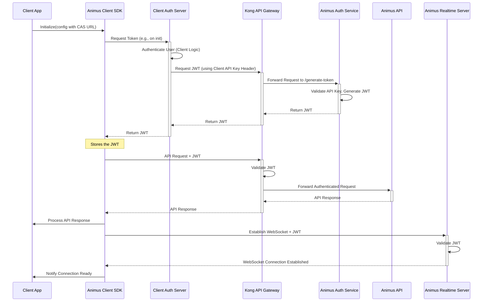

# Animus Orchestration Layer Architecture

This document outlines the architecture for the Animus orchestration layer, which provides B2B clients with easy access to Animus AI capabilities through a front-end SDK.

## System Overview

The Animus orchestration layer enables business customers to integrate AI capabilities into their applications with minimal effort. The front-end SDK handles complex methods and real-time capabilities, interacting with both the client's authentication backend and various Animus services.

## Architecture Components

### Client-Side Components
- **End User**: Users of the B2B client's application who interact with Animus AI services.
- **Client Application**: The B2B customer's application that integrates with Animus.
- **Animus Client SDK**: SDK provided by Animus that handles communication. It requires initialization with a URL to the client's own Auth Server to fetch necessary tokens.
- **Client Auth Server (Client's Backend)**: Server maintained by the B2B client (NOT Animus). Responsible for:
    - Authenticating the client's end-user.
    - Calling the Animus Auth Service (`https://api.animusai.co/auth/generate-token`) with the client's `apikey` header to obtain a JWT.
    - Returning the single JWT to the SDK. This JWT is used for both API and Realtime access.

### Gateway Layer
- **Kong API Gateway**: Routes standard API requests (using the JWT) to the Animus API. Also routes requests from the Client Auth Server to the Animus Auth Service for JWT generation. Does *not* handle direct WebSocket connections from the SDK.

### Animus Services
- **Animus API**: Handles synchronous requests to AI models, accessed via Kong.
- **Animus Auth Service**: Centralized service (`https://api.animusai.co/auth/generate-token`) responsible for issuing JWTs based on the client's API key. Accessed via Kong by the Client Auth Server.
- **Animus Realtime Server**: Manages persistent WebSocket connections for realtime chat and messaging, authenticating using the JWT. Operates independently of Kong for SDK connections.
- **LiveKit Service**: Manages WebRTC voice/video streaming. Accessed *via* the Animus Realtime Server, which acts as a proxy/controller.
- **ZEP/Graffiti**: Memory layer storing conversation history, potentially accessed by both Animus API and Animus Realtime Server. (Assuming still relevant).

### AI Models
- **Large Language Models (LLMs)**: Process text inputs and generate responses.
- **Speech-to-Text (STT)**: Convert audio to text.
- **Text-to-Speech (TTS)**: Convert text to audio.
- **Future Models**: Image and video processing models (planned).

## Core Architecture Diagram

```mermaid
graph LR
    %% Client Environment
    subgraph "Client Environment"
        User((End User)) --> ClientApp[Client Application]
        ClientApp --> SDK[Animus Client SDK]
        SDK -->|"Init: Request Token"| CAS[Client Auth Server]
    end

    %% Gateway
    subgraph "API Gateway"
        Kong[Kong API Gateway]
    end

    %% Animus Services
    subgraph "Animus Services"
        API[Animus API]
        RTS[Animus Realtime Server]
        AAS[Animus Auth Service\n(/generate-token)]
        LK[LiveKit Service]
        ZEP[ZEP/Graffiti Memory]
    end

    %% AI Models
    subgraph "AI Models"
        LLM[LLMs]
        STT[STT]
        TTS[TTS]
        Media[Future Media]
    end

    %% Connections
    CAS -->|"1. Request JWT\n(Client API Key)"| Kong
    Kong -->|"2. Forward to AAS"| AAS
    AAS -->|"3. Issue JWT"| Kong
    Kong -->|"4. Return JWT"| CAS
    CAS -->|"5. Return JWT"| SDK

    SDK -->|"API Calls (JWT)"| Kong
    Kong -->|"Route API Call"| API

    SDK -->|"WebSocket (JWT)"| RTS

    RTS -->|"Chat/Messages"| LLM
    RTS -->|"Voice/Video Proxy"| LK
    RTS -->|"History"| ZEP

    API -->|"Processing"| LLM & STT & TTS & Media
    API -->|"History"| ZEP

    LK -->|"Streaming"| STT & TTS & Media

    %% Styling
    classDef client fill:#86C1D4,stroke:#05445E,color:#000000,font-weight:bold
    classDef gateway fill:#E5A158,stroke:#9C6644,color:#000000,font-weight:bold
    classDef animusServices fill:#8FC69E,stroke:#0F5D11,color:#000000,font-weight:bold
    classDef aiModels fill:#E5909E,stroke:#9A1B30,color:#000000,font-weight:bold
    classDef memory fill:#E5A96F,stroke:#9E5D20,color:#000000,font-weight:bold

    class User,ClientApp,SDK,CAS client
    class Kong gateway
    class API,RTS,AAS,LK animusServices
    class LLM,STT,TTS,Media aiModels
    class ZEP memory
```

## SDK Configuration and Routing

The SDK requires initialization with the URL of the **Client Auth Server**. This client-side server is responsible for contacting the Animus Auth Service (`https://api.animusai.co/auth/generate-token`) using the client's API key to obtain a single JWT. The SDK then fetches this JWT from the Client Auth Server. This JWT is used for both standard API calls via Kong and WebSocket connections to the Animus Realtime Server.

The SDK configuration, set during or after initialization, determines which communication path and token to use for specific operations.

### Initialization Parameter

-   `clientAuthServerUrl` (String, **Required**): The URL endpoint on the client's backend (Client Auth Server) that the SDK will call to fetch the JWT. This backend server must handle calling the Animus Auth Service (`/generate-token`) with the appropriate API key.

### Configuration Options (Example Structure)

*(Note: The Mermaid diagram for configuration options represents the *types* of settings available.)*

```mermaid
graph TD
    SDKInit[SDK Initialization] --> ClientAuthURL[clientAuthServerUrl: String]
    SDKInit --> Config[Configuration Object]

    Config --> SessionConfig[Session Configuration]
    SessionConfig --> SessionID[sessionId: String]
    SessionConfig --> UserID[userId: String]

    Config --> ServiceMode[Service Mode]
    ServiceMode --> UseApi[useApi: Boolean]
    ServiceMode --> UseRealtime[useRealtime: Object]

    UseRealtime --> Observer[observer: Boolean]
    UseRealtime --> Audio[audio: Boolean]
    UseRealtime --> Vision[vision: Boolean]

    Config --> MemoryOptions[Memory Options]
    MemoryOptions --> MemoryEnabled[memoryEnabled: Boolean]
    MemoryOptions --> RetentionPeriod[retentionPeriod: Number]

    Config --> ModelPreferences[Model Preferences]
    ModelPreferences --> PreferredLLM[llmModel: String]
    ModelPreferences --> PreferredTTS[ttsModel: String]
    ModelPreferences --> PreferredSTT[sttModel: String]

    classDef main fill:#86C1D4,stroke:#05445E,color:#000000,font-weight:bold
    classDef section fill:#E5A158,stroke:#9C6644,color:#000000,font-weight:bold
    classDef options fill:#8FC69E,stroke:#0F5D11,color:#000000,font-weight:bold

    class SDKInit,Config, ClientAuthURL main
    class SessionConfig,ServiceMode,UseRealtime,MemoryOptions,ModelPreferences section
    class SessionID,UserID,UseApi,Observer,Audio,Vision,MemoryEnabled,RetentionPeriod,PreferredLLM,PreferredTTS,PreferredSTT options
```

### Configuration Details

1.  **Service Mode Configuration**:
    *   `useApi` (Boolean, Optional, Default: true): Determines if standard API calls (e.g., for non-realtime chat, data management) should be enabled and routed via Kong using the JWT.
    *   `useRealtime` (Object, Optional): Controls real-time capabilities via the Animus Realtime Server using the JWT.
        *   `enabled` (Boolean, Optional, Default: true if `useRealtime` object exists): Master switch for enabling WebSocket connection to the Animus Realtime Server.
        *   `observer` (Boolean): Enables proactive messaging from the Animus Realtime Server.
        *   `audio` (Boolean): Enables STT/TTS capabilities, proxied through Animus Realtime Server to LiveKit.
        *   `vision` (Boolean): Enables visual input processing, proxied through Animus Realtime Server to LiveKit.

2.  **Session Configuration**:
    *   `sessionId` (String): Unique identifier for the conversation session.
    *   `userId` (String): Identifier for the end user.

3.  **Memory Options**: (Assuming ZEP is used by both API and RTS)
    *   `memoryEnabled` (Boolean): Enables the ZEP/Graffiti memory layer.
    *   `retentionPeriod` (Number): Number of days to retain conversation history.

4.  **Model Preferences**:
    *   `llmModel` (String): Preferred LLM model.
    *   `ttsModel` (String): Preferred TTS model.
    *   `sttModel` (String): Preferred STT model.

### Routing Logic Based on Configuration

```mermaid
flowchart TD
    Start([SDK Method Call]) --> NeedTokens{Tokens Available?}
    NeedTokens -->|No| FetchToken[Call Client Auth Server URL]
    FetchToken --> StoreToken[Store JWT]
    NeedTokens -->|Yes| StoreToken
    StoreToken --> ActionType{Action Type?}

    ActionType -->|Standard API Call| ApiPath{useApi Enabled?}
    ApiPath -->|Yes| PrepareAPI[Prepare HTTP Request]
    PrepareAPI --> AddJWT[Add JWT]
    AddJWT --> SendToKong[Send to Kong API Gateway]
    SendToKong --> KongRoutesAPI[Kong -> Animus API]
    KongRoutesAPI --> ProcessAPI[Animus API Processes]
    ProcessAPI --> CheckMemoryAPI{memoryEnabled?}
    CheckMemoryAPI -->|Yes| UseZEP_API[Access ZEP]
    CheckMemoryAPI -->|No| SkipZEP_API[Skip ZEP]
    UseZEP_API --> RespondAPI[Send Response via Kong]
    SkipZEP_API --> RespondAPI
    RespondAPI --> EndAPI([Return Result])
    ApiPath -->|No| ErrorAPI([Error: API Disabled])


    ActionType -->|Realtime Action\n(e.g., connect, send message)| RTPath{useRealtime Enabled?}
    RTPath -->|Yes| CheckConnection{WebSocket Connected?}
    CheckConnection -->|No| ConnectWS[Connect to Animus Realtime Server]
    ConnectWS --> AddJWT_WS[Add JWT]
    AddJWT_WS --> ValidateWS[RTS Validates JWT]
    ValidateWS --> Connected[Connection Established]
    CheckConnection -->|Yes| Connected
    Connected --> SendToRTS[Send/Receive via WebSocket]
    SendToRTS --> RTS_Logic{Realtime Logic}
    RTS_Logic -->|Chat Message| RTS_ProcessChat[RTS Processes Chat w/ LLM]
    RTS_Logic -->|Audio/Video Request| RTS_ProxyLK[RTS Proxies to LiveKit]
    RTS_Logic -->|Observer Message| RTS_PushObserver[RTS Pushes Message]

    RTS_ProcessChat --> CheckMemoryRT{memoryEnabled?}
    RTS_ProxyLK --> CheckMemoryRT
    RTS_PushObserver --> CheckMemoryRT

    CheckMemoryRT -->|Yes| UseZEP_RT[Access ZEP]
    CheckMemoryRT -->|No| SkipZEP_RT[Skip ZEP]
    UseZEP_RT --> EndRT([Continue Realtime Interaction])
    SkipZEP_RT --> EndRT
    RTPath -->|No| ErrorRT([Error: Realtime Disabled])

    classDef start fill:#86C1D4,stroke:#05445E,color:#000000,font-weight:bold
    classDef decision fill:#E5A158,stroke:#9C6644,color:#000000,font-weight:bold
    classDef apiPath fill:#8FC69E,stroke:#0F5D11,color:#000000,font-weight:bold
    classDef rtPath fill:#E5909E,stroke:#9A1B30,color:#000000,font-weight:bold
    classDef memory fill:#E5A96F,stroke:#9E5D20,color:#000000,font-weight:bold
    classDef error fill:#FFCCCC,stroke:#CC0000,color:#000000,font-weight:bold

    class Start start
    class NeedTokens,ActionType,ApiPath,RTPath,CheckConnection,CheckMemoryAPI,CheckMemoryRT decision
    class PrepareAPI,AddJWT,SendToKong,KongRoutesAPI,ProcessAPI,RespondAPI,EndAPI apiPath
    class ConnectWS,AddJWT_WS,ValidateWS,Connected,SendToRTS,RTS_Logic,RTS_ProcessChat,RTS_ProxyLK,RTS_PushObserver,EndRT rtPath
    class UseZEP_API,SkipZEP_API,UseZEP_RT,SkipZEP_RT memory
    class FetchToken,StoreToken apiPath
    class ErrorAPI,ErrorRT error
```

### Example Configurations and Their Effects

1.  **API-Only Interaction (No Realtime)**
    ```javascript
    const sdk = new AnimusSDK({
      clientAuthServerUrl: "https://client.com/auth/animus-tokens",
      mode: {
        useApi: true,
        useRealtime: { enabled: false } // Explicitly disable realtime
      },
      memory: { enabled: true },
      session: { id: "user1-session1" }
    });
    ```
    Result: SDK fetches the JWT but only uses it for API calls via Kong. WebSocket connection is never established.

2.  **Real-time Chat Only (No standard API calls needed by app)**
    ```javascript
    const sdk = new AnimusSDK({
      clientAuthServerUrl: "https://client.com/auth/animus-tokens",
      mode: {
        useApi: false, // Disable standard API path if not needed
        useRealtime: {
          enabled: true,
          observer: true, // Allow proactive messages
          audio: false,
          vision: false
        }
      },
      memory: { enabled: true },
      session: { id: "user2-session2" }
    });
    ```
    Result: SDK fetches the JWT, establishes WebSocket connection to Animus Realtime Server using the JWT. API calls via Kong would fail if attempted.

3.  **Full Capabilities (API + Realtime Audio/Video)**
    ```javascript
    const sdk = new AnimusSDK({
      clientAuthServerUrl: "https://client.com/auth/animus-tokens",
      mode: {
        useApi: true,
        useRealtime: {
          enabled: true,
          observer: true,
          audio: true,
          vision: true // Assuming vision uses LiveKit via RTS
        }
      },
      memory: { enabled: true },
      session: { id: "user3-session3" }
    });
    ```
    Result: SDK uses the JWT for API calls via Kong, and the same JWT for WebSocket connection to Animus Realtime Server, which proxies to LiveKit for audio/vision.

## Authentication Flow



## Data Flow for Synchronous and Real-time Interactions


## Component Relationships

```mermaid
graph TD
    %% Client Components
    subgraph "Client Environment"
        ClientApp[Client Application]
        SDK[Animus Client SDK]
        CAS[Client Auth Server]
    end

    %% Gateway
    subgraph "API Gateway"
        Kong[Kong API Gateway]
    end

    %% Animus Services
    subgraph "Animus Services"
        API[Animus API]
        RTS[Animus Realtime Server]
        AAS[Animus Auth Service]
        LK[LiveKit Service]
    end

    %% AI Models
    subgraph "AI Models"
        AIModels((AI Models))
    end

    %% Memory Layer
    subgraph "Memory Layer"
        ZEP[ZEP/Graffiti]
    end

    %% Connections
    ClientApp --> SDK
    SDK -->|"1. Request Tokens"| CAS
    CAS -->|"2. Req JWT (API Key)"| Kong
    Kong -->|"3. Fwd to AAS"| AAS
    AAS -->|"4. Issue JWT"| Kong
    Kong -->|"5. Return JWT"| CAS
    CAS -->|"6. Return JWT"| SDK

    SDK -->|"API Calls (JWT)"| Kong
    Kong -->|"Route API"| API

    SDK -->|"WebSocket (JWT)"| RTS

    API --> AIModels
    API <--> ZEP

    RTS --> AIModels
    RTS -->|"Proxy/Control"| LK
    RTS <--> ZEP

    LK --> AIModels  // For direct media processing if needed

    %% Styling
    classDef client fill:#86C1D4,stroke:#05445E,color:#000000,font-weight:bold
    classDef gateway fill:#E5A158,stroke:#9C6644,color:#000000,font-weight:bold
    classDef animusServices fill:#8FC69E,stroke:#0F5D11,color:#000000,font-weight:bold
    classDef aiModels fill:#E5909E,stroke:#9A1B30,color:#000000,font-weight:bold
    classDef memory fill:#E5A96F,stroke:#9E5D20,color:#000000,font-weight:bold

    class ClientApp,SDK,CAS client
    class Kong gateway
    class API,RTS,AAS,LK animusServices
    class AIModels aiModels
    class ZEP memory
```

## Recommended SDK Configuration Structure

```javascript
 const animusSDK = new AnimusSDK({
   // **REQUIRED**: URL for fetching tokens from client's backend
   clientAuthServerUrl: "https://your-backend.com/api/animus-auth",

   // Core service mode configuration
   mode: {
     useApi: true,                 // Enable synchronous API calls via Kong (uses the JWT)
     useRealtime: {                 // Real-time capabilities via Animus Realtime Server (uses the JWT)
       enabled: true,            // Master switch for real-time features
       observer: true,           // Allow AI to proactively message
       audio: true,              // Enable speech capabilities (via LiveKit proxy)
       vision: true              // Enable visual input processing (via LiveKit proxy)
     }
   },

   // Session tracking
   session: {
     id: "user123-session456",   // Unique session identifier
     userId: "user789",          // User identifier
     persist: true               // Persist session between page loads (SDK implementation detail)
   },

   // Memory configuration
   memory: {
     enabled: true,              // Enable conversation history (ZEP)
     retentionDays: 30,          // Store conversations for 30 days
     contextWindow: 10           // Number of previous exchanges to include (if supported)
   },

   // Model preferences
   models: {
     llm: "animus-chat-1",       // LLM model preference
     tts: "animus-voice-natural", // TTS model preference
     stt: "animus-transcribe-1"  // STT model preference
   },

   // Media handling (Primarily affects LiveKit interaction)
   media: {
     audioQuality: "high",       // Audio quality setting
     videoResolution: "720p",    // Video resolution for vision features
     captureDevice: "default"    // Camera/mic device selection
   }
 });
 ```
 This configuration structure provides a comprehensive way to control all aspects of the SDK's behavior while maintaining flexibility for future enhancements.